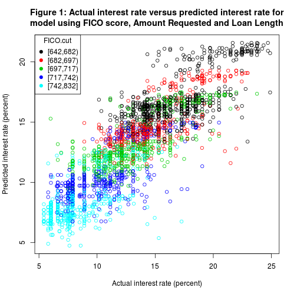

## Example - using ANOVA in the exploratory data analysis

<!-- html table generated in R 3.1.1 by xtable 1.7-3 package -->
<!-- Sat Jul 26 09:36:24 2014 -->
<TABLE border=1>
<TR> <TH>  </TH> <TH> Df </TH> <TH> Sum Sq </TH> <TH> Mean Sq </TH> <TH> F value </TH> <TH> Pr(&gt;F) </TH>  </TR>
  <TR> <TD> loansData$FICO.cut </TD> <TD align="right"> 4 </TD> <TD align="right"> 22356.99 </TD> <TD align="right"> 5589.25 </TD> <TD align="right"> 1451.56 </TD> <TD align="right"> 0.0000 </TD> </TR>
  <TR> <TD> scale(loansData$Amount.Requested) </TD> <TD align="right"> 1 </TD> <TD align="right"> 6890.05 </TD> <TD align="right"> 6890.05 </TD> <TD align="right"> 1789.38 </TD> <TD align="right"> 0.0000 </TD> </TR>
  <TR> <TD> loansData$Loan.Length </TD> <TD align="right"> 1 </TD> <TD align="right"> 3959.22 </TD> <TD align="right"> 3959.22 </TD> <TD align="right"> 1028.23 </TD> <TD align="right"> 0.0000 </TD> </TR>
  <TR> <TD> scale(loansData$Monthly.Income) </TD> <TD align="right"> 1 </TD> <TD align="right"> 74.49 </TD> <TD align="right"> 74.49 </TD> <TD align="right"> 19.35 </TD> <TD align="right"> 0.0000 </TD> </TR>
  <TR> <TD> loansData$Inquiries.in.the.Last.6.Months </TD> <TD align="right"> 1 </TD> <TD align="right"> 418.80 </TD> <TD align="right"> 418.80 </TD> <TD align="right"> 108.76 </TD> <TD align="right"> 0.0000 </TD> </TR>
  <TR> <TD> loansData$Loan.Purpose </TD> <TD align="right"> 13 </TD> <TD align="right"> 206.19 </TD> <TD align="right"> 15.86 </TD> <TD align="right"> 4.12 </TD> <TD align="right"> 0.0000 </TD> </TR>
  <TR> <TD> scale(loansData$Open.CREDIT.Lines) </TD> <TD align="right"> 1 </TD> <TD align="right"> 56.37 </TD> <TD align="right"> 56.37 </TD> <TD align="right"> 14.64 </TD> <TD align="right"> 0.0001 </TD> </TR>
  <TR> <TD> loansData$Home.Ownership </TD> <TD align="right"> 3 </TD> <TD align="right"> 59.33 </TD> <TD align="right"> 19.78 </TD> <TD align="right"> 5.14 </TD> <TD align="right"> 0.0015 </TD> </TR>
  <TR> <TD> loansData$State </TD> <TD align="right"> 45 </TD> <TD align="right"> 231.40 </TD> <TD align="right"> 5.14 </TD> <TD align="right"> 1.34 </TD> <TD align="right"> 0.0679 </TD> </TR>
  <TR> <TD> scale(loansData$debtToIncome) </TD> <TD align="right"> 1 </TD> <TD align="right"> 10.41 </TD> <TD align="right"> 10.41 </TD> <TD align="right"> 2.70 </TD> <TD align="right"> 0.1003 </TD> </TR>
  <TR> <TD> scale(loansData$Revolving.CREDIT.Balance) </TD> <TD align="right"> 1 </TD> <TD align="right"> 3.70 </TD> <TD align="right"> 3.70 </TD> <TD align="right"> 0.96 </TD> <TD align="right"> 0.3271 </TD> </TR>
  <TR> <TD> loansData$Employment.Length </TD> <TD align="right"> 11 </TD> <TD align="right"> 24.88 </TD> <TD align="right"> 2.26 </TD> <TD align="right"> 0.59 </TD> <TD align="right"> 0.8407 </TD> </TR>
  <TR> <TD> Residuals </TD> <TD align="right"> 2414 </TD> <TD align="right"> 9295.17 </TD> <TD align="right"> 3.85 </TD> <TD align="right">  </TD> <TD align="right">  </TD> </TR>
   </TABLE>

--- &twocol

## Predictive model

*** =left

- Conclusions: 
   - Several variables are related to the interest rate but some are also related to FICO score
   - So let's use a very simple model using FICO Score, Amount Requested and Loan Length
   - Figure 1 shows the actual interest rate versus predicted interest rate
   - The model achieves an R squared value of 0.7453
   - [The predictive model is available as a Shiny App](http://tamdemz.shinyapps.io/read) 

*** =right

 

